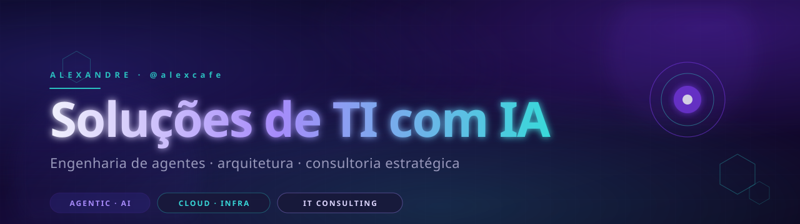

<!--
  alexcafe/alexcafe — GitHub Profile README
  Design system: RQH (handoff/) — paleta dark-first
    navy   #2d2480   violet #7c3aed   cyan   #2abfbf
    s0     #06061a   s1     #0d0d28   s2     #181838   s3 #222248
    fg1    #f0f0fc   fg2    #9898bb   fg3    #5a5a80
  Cores em shields/stats sao hardcoded em hex pra fidelidade ao design system.
-->

  

  

  
  
  
  

  

##

### 🇧🇷 Sobre

Engenheiro de soluções de TI com foco em **inteligência artificial aplicada**. Construo agentes, pipelines RAG e integrações que viram operação — não demo. Atendo empresas que querem **operacionalizar IA sem virar laboratório**: do diagnóstico técnico ao deploy em produção.

Base em **Brasília-DF** · cofundador da [**RQH Soluções**](mailto:comercial@rqhsolucoes.com) · disponível para consultoria de arquitetura, modernização legacy, e squads sob demanda.

<b>🇬🇧 English version</b>

 

IT solutions engineer focused on **applied AI**. I build agents, RAG pipelines and integrations that ship to production — not just demos. I work with companies that want to **operationalize AI without becoming a research lab**: from technical discovery to production deploy.

Based in **Brasília, Brazil** · co-founder of [**RQH Soluções**](mailto:comercial@rqhsolucoes.com) · available for architecture consulting, legacy modernization, and on-demand engineering squads.

  

##

### ⚡ Stack

**AI / ML**

  
  
  
  
  
  
  

**Backend & Cloud**

  
  
  
  
  
  
  
  
  
  

  

##

### 📊 Métricas

<table align="center" border="0">
  <tr>
    <td align="center" valign="top" width="50%">
      
    </td>
    <td align="center" valign="top" width="50%">
      
    </td>
  </tr>
  <tr>
    <td colspan="2" align="center">
      
    </td>
  </tr>
</table>

#### 🐍 Atividade

<picture>
  <source media="(prefers-color-scheme: dark)" srcset="https://raw.githubusercontent.com/alexcafe/alexcafe/output/snake-dark.svg"/>
  <source media="(prefers-color-scheme: light)" srcset="https://raw.githubusercontent.com/alexcafe/alexcafe/output/snake-dark.svg"/>
  
</picture>

  

##

### 🚀 Projetos em destaque

<table align="center" border="0">
  <tr>
    <td width="50%" align="center">
      
    </td>
    <td width="50%" align="center">
      <a href="https://rqhsolucoes.com">
        
          
        <i>Mais projetos via os pins do perfil ↑</i>
      </a>
    </td>
  </tr>
</table>

  

##

### 💬 Vamos conversar

  
  
  

  📍 Brasília-DF · 🇧🇷 · Disponível para consultoria e squads

 

  

<!--
  Visitor counter (opcional — desabilitado por padrao):
  
-->
